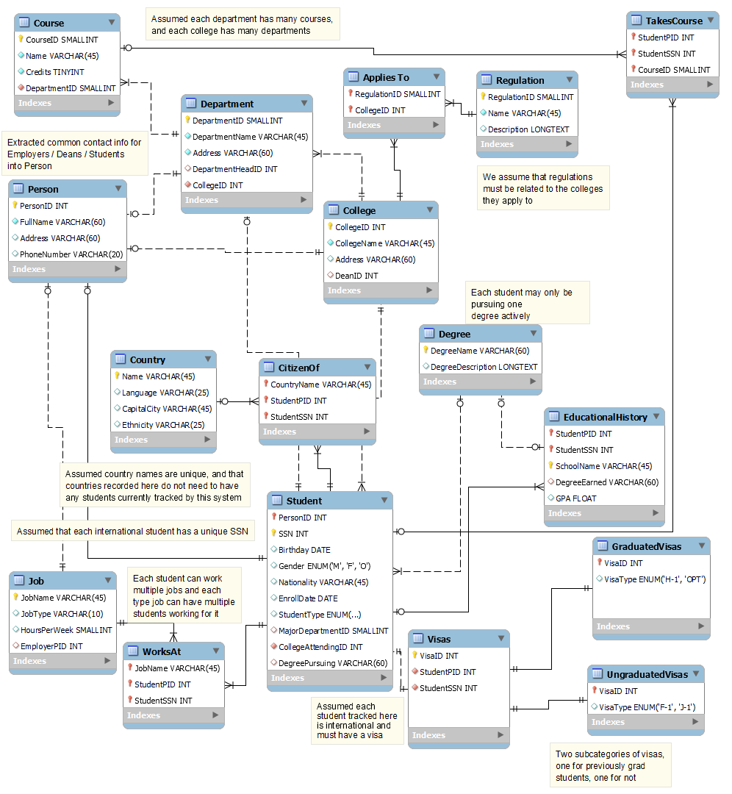

# Database_Project
## Problem Discription 

This project is an academic project. The project aimed to develop an international student information system Database for the international 
student office at Bellevue College. In this project, we produced an extended entity-relationship model relational schema and wrote the SQL DDL
(Data Definition Language) statement. Wrote Loading script using MySQL to load the data, prepared and load dummy data, wrote a java program 
and connected java with the database, and tested it. 

## Technologies 
- MYSQL
- Java
- Oracle JDBC API
- JDBC Driver

## How to use 
- Start by reading the provided project requirement document (pdf)
- You need to install MYSQL to run the Query files 
- You need Java and the above-listed API and driver installed 
- Then run the respective files accordingly 

## EER Model

## Demo Video

https://user-images.githubusercontent.com/94527061/142370221-33dd835b-b7f4-4b99-94f8-f60affa290d5.mp4

